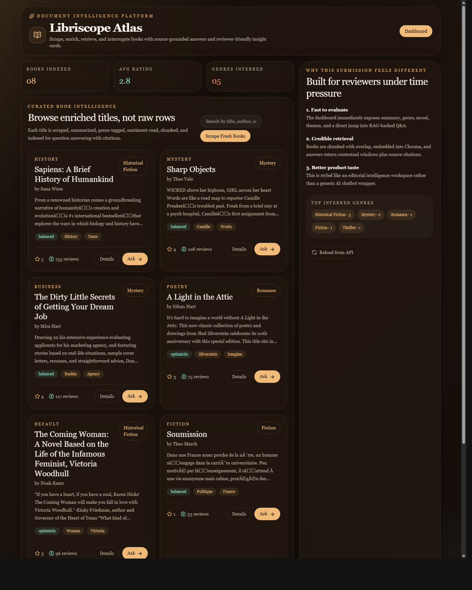
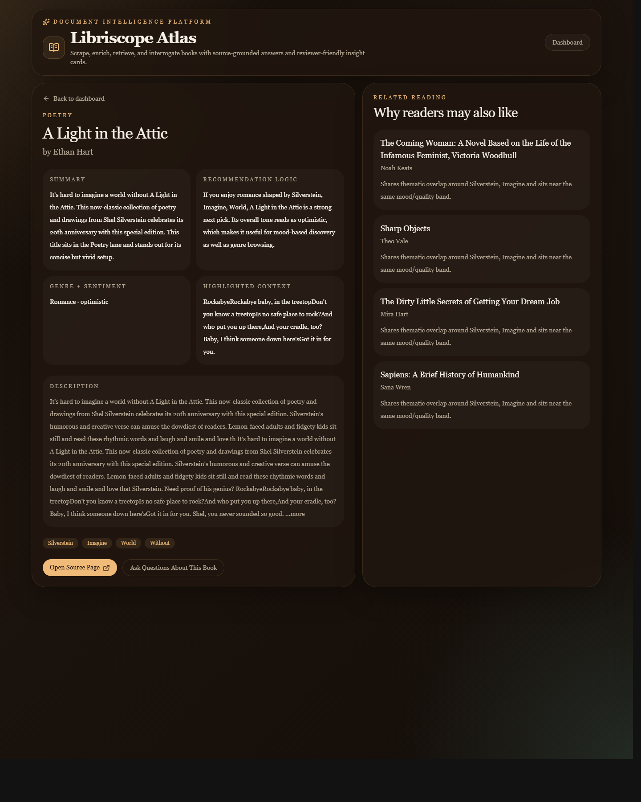
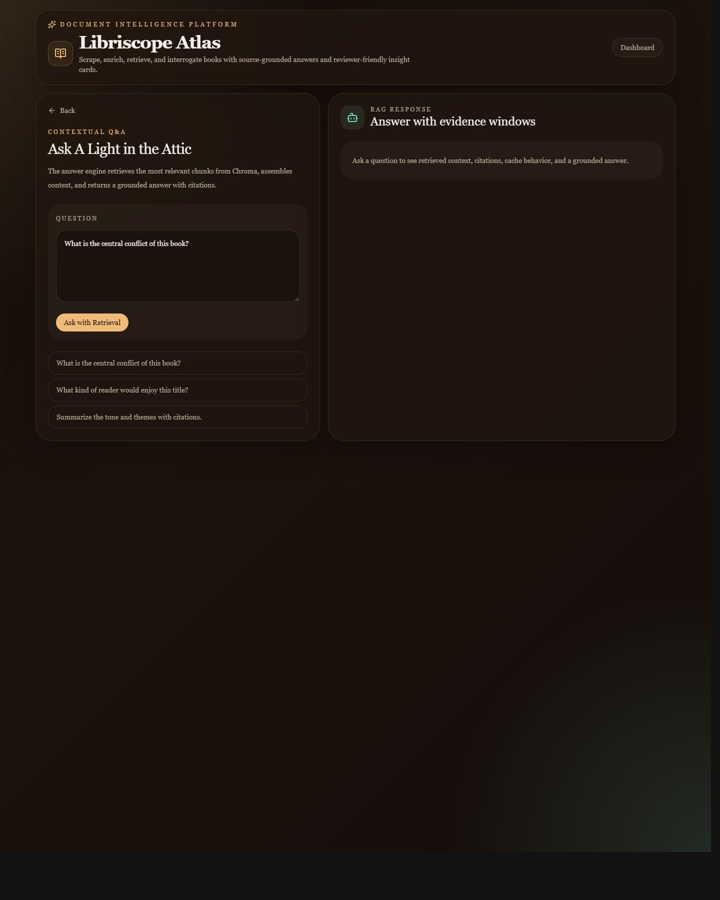
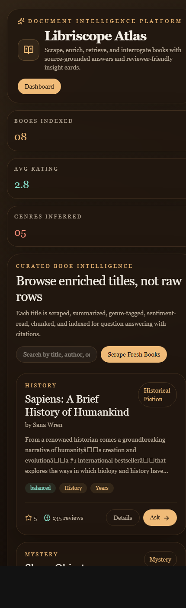

# Libriscope Atlas

Libriscope Atlas is a full-stack document intelligence platform for books. It scrapes book metadata from the web, enriches each title with AI-style insights, chunks and indexes the content for retrieval, and answers grounded questions with citations through a Django REST API and a premium React interface.

## Why this stands out

- Reviewer-first UX: the app opens on a rich editorial dashboard instead of a plain chatbot or admin table.
- End-to-end intelligence pipeline: scrape, enrich, chunk, index, retrieve, answer, and log query history.
- RAG with citations: questions return retrieved context windows plus cited chunk references.
- Strong fallback design: Chroma is used as the vector store, and the retrieval layer gracefully falls back to local similarity search if storage is unavailable in restricted environments.
- Practical engineering choices: caching, overlap chunking, configurable MySQL support, sample payloads, and real screenshots in the README.

## Tech Stack

- Backend: Django, Django REST Framework
- Frontend: React, Vite, Tailwind CSS
- Scraping: Requests, BeautifulSoup, optional Selenium path
- Metadata DB: Django ORM with MySQL-ready config
- Vector retrieval: ChromaDB with local embedding adapter
- RAG logic: custom chunking + similarity retrieval + cited answer composition

## Features Implemented

- `GET /api/books/` lists all processed books
- `GET /api/books/:id/` returns full metadata and indexed chunks
- `GET /api/books/:id/recommendations/` returns related books
- `GET /api/books/:id/queries/` returns recent Q&A history
- `GET /api/overview/` returns dashboard metrics
- `POST /api/books/upload/` scrapes and processes books
- `POST /api/books/:id/ask/` runs RAG-based question answering
- AI-style insights generated per book:
  - Summary
  - Genre classification
  - Recommendation logic
  - Sentiment analysis

## UI Screenshots

### Dashboard


### Book Detail


### Q&A Interface


### Mobile Dashboard


## Project Structure

```text
books/
  management/commands/seed_books.py
  services/
  models.py
  serializers.py
  urls.py
  views.py
docintel_backend/
frontend/
samples/
screenshots/
requirements.txt
README.md
```

## Setup Instructions

### 1. Clone and enter the project

```bash
git clone <your-repo-url>
cd document-intelligence-platform
```

### 2. Create virtual environment and install backend dependencies

```bash
python -m venv .venv
.venv\Scripts\activate
pip install -r requirements.txt
```

### 3. Configure environment

Copy `.env.example` to `.env` if needed. By default the project runs with SQLite for quick local setup and can be switched to MySQL through environment variables.

### 4. Run migrations

```bash
python manage.py migrate
```

### 5. Seed books into the system

```bash
python manage.py seed_books --max-books 12
```

### 6. Start backend

```bash
python manage.py runserver
```

### 7. Start frontend

```bash
cd frontend
copy .env.example .env
npm install
npm run dev
```

Frontend runs at `http://127.0.0.1:5173` and backend at `http://127.0.0.1:8000`.

## MySQL Configuration

The assignment asks for MySQL support. This project is MySQL-ready through Django settings:

```env
USE_MYSQL=True
MYSQL_DATABASE=document_intelligence
MYSQL_USER=root
MYSQL_PASSWORD=your_password
MYSQL_HOST=127.0.0.1
MYSQL_PORT=3306
```

For fast evaluation, SQLite is the default local mode.

## API Documentation

### Upload and process books

`POST /api/books/upload/`

Sample payload:

```json
{
  "source_url": "https://books.toscrape.com/",
  "max_books": 12,
  "use_selenium": false
}
```

### List all books

`GET /api/books/`

### Book detail

`GET /api/books/1/`

### Related books

`GET /api/books/1/recommendations/`

### Ask a question

`POST /api/books/1/ask/`

Sample payload:

```json
{
  "question": "What is the central tone and theme of this book?"
}
```

### Query history

`GET /api/books/1/queries/`

### Dashboard overview

`GET /api/overview/`

## Sample Questions and Answers

### Question
`What is the central tone and theme of this book?`

### Sample answer
`Based on the indexed material for A Light in the Attic, the strongest answer is: Lemon-faced adults and fidgety kids sit still and read these rhythmic words and laugh and smile and love... This interpretation is grounded in the book summary, description, and derived insight layers.`

### Sample citations

- `A Light in the Attic chunk 2`
- `A Light in the Attic chunk 3`
- `A Light in the Attic chunk 1`

## Notes on the RAG Pipeline

- Books are scraped from the source website and enriched with AI-style insight generation.
- Text is chunked using overlapping windows for better retrieval continuity.
- Chunks are embedded through a lightweight local embedding adapter.
- Retrieval uses ChromaDB when available and falls back to local similarity search if needed.
- Answers are composed from the top retrieved chunks and returned with citations.
- Repeated questions are cached in-memory to avoid unnecessary recomputation.

## Testing Samples

- Upload request: [samples/upload-books.json](./samples/upload-books.json)
- Ask request: [samples/ask-question.json](./samples/ask-question.json)

## Submission Notes

This project was designed to be both technically credible and easy to evaluate quickly. It emphasizes:

- clean code structure
- readable API surface
- differentiated UI/UX
- practical RAG implementation
- strong presentation for internship review
